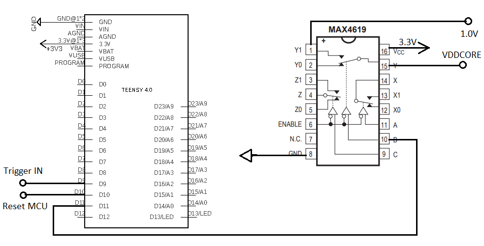

# Trustzone-M(eh) attack replication 

## Author:Marek Lörinc (xlorin00@fit.vutbr.cz)
## Login: xlorin00

## Hardware prerequisities
Sam L11 Xplained Pro
Teensy 4.0
Transistor MOSFET N + Resistor 100Ω (Option 1)
Multiplexor (Option 2)

## Software prerequisities
Atmel Studio 7.0
Arduino + Teensyduino

## Wiring diagram for connecting the Teensy to Sam L11
Option 1:

Option 2:

Trigger IN: PINA10 of SAML11

Reset MCU: Reset pin of SAML11
## Firmware upload to Teensy 
For attack when you want to boot nonsecure code as secure in SAM L11, open boot_nonsec_as_sec.ino in Arduino and click upload

For attack when you want to inject multiplication fault in SAM L11, open mul_err.ino in Arduino and click upload

## Firmware upload to SAM L11 XPLAINED PRO
For attack when you want to boot nonsecure code as secure in SAM L11, create project LED_flasher following this manual(pages 7-12): http://ww1.microchip.com/downloads/en/Appnotes/Getting-Started-with-SAM%20L10L11-Xplained-Pro-DS00002722A.pdf, then replace led_flasher_main.c by file in Atmel_studio/faulting_mul folder

For attack when you want to inject multiplication fault in SAM L11, create project by following same manual (pages 15-37), then replace main.c by file in Atmel_studio/boot_nonsec_as_sec folder

If attack is successfull, LED on SAM L11 board blinks (both cases)
