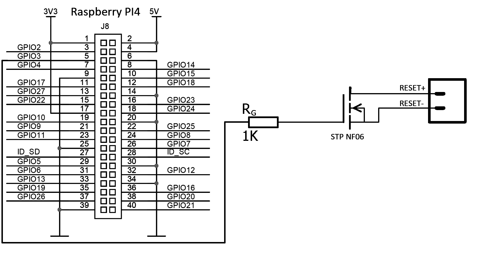

# Auto reset PC by Raspberry PI 4.0

## Author:Marek Lörinc (xlorin00@fit.vutbr.cz)
## Login: xlorin00


### Wiring diagram for connecting the RPi to PC


### RUN
Run script on raspberry PI 4.0 with command:
```
python3 reset_PC.py Hostname
```
Hostname is PC ip address